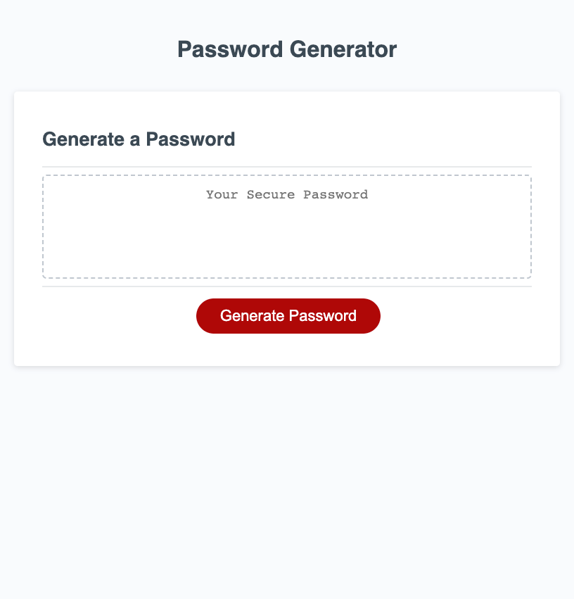

# BCS Module 3 Challenge - JavaScript - Password Generator

## Description

This is a simple password generator that displays my working knowledge of JavaScript functions, methods, scope, variables, conditional statements, for loops, and DOM manipulation. 

This generator will create a password for a user based on their input criteria from several browser prompts. 

## Usage
To begin generating a password, click the button on the page that reads "Generate Password". Once clicked, you will receive your first prompt, asking you how long you would like your password to be. If you do not meet the length requirements, you will be given an error message. If you meet the length requirements, you will be sent to the next steps. 

You will then be asked if you would like to include uppercase and/or lowercase letters, numbers, and special characters in your password. Selecting "Ok" tells the prompt you would like the aforementioned criteria included, and selecting "Cancel" will tell the prompt you would not like it included. 

Once you have answered all the prompts, your password will be generated and written into the text box near the middle of the screen.